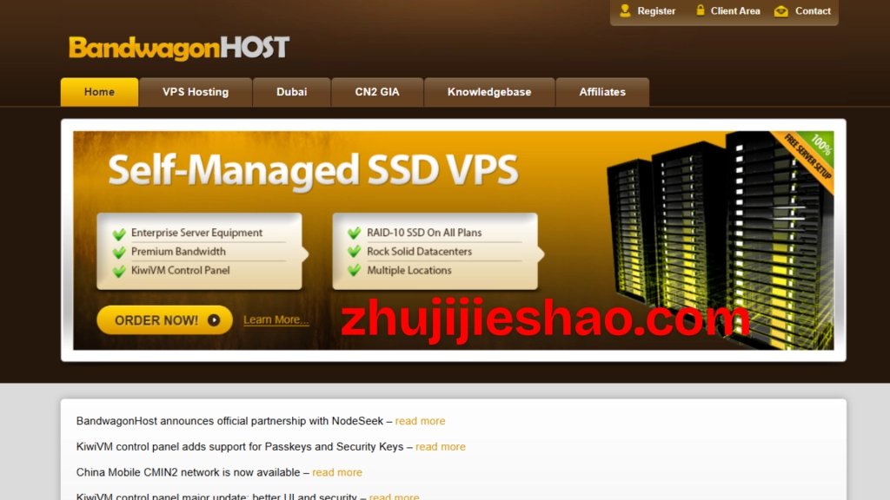

# 搬瓦工VPS 10Gbps极速专线：香港/日本/新加坡CN2 GIA及荷兰AS9929线路测评

---

如果你正在找一台晚高峰不掉速的国外VPS，或者你的业务对网络延迟有严格要求，那搬瓦工（BandwagonHost）可能是个值得认真考虑的选择。这家隶属于2004年成立的加拿大IT7公司的服务商，专门针对中国市场做了网络优化：最高10Gbps带宽，覆盖香港CN2 GIA、日本CN2 GIA（大阪+东京）、新加坡CN2 GIA、美国CN2 GIA、加拿大CN2 GIA、荷兰AS9929、澳大利亚AS9929等高端线路。说白了，就是那种"贵但确实快"的企业级专线。

## 官网地址与付款方式

**官网**：bandwagonhost.com

**付款方式**：支持信用卡、PayPal、支付宝、银联，对国内用户相当友好。

---

## Basic VPS系列 – 适合预算有限的入门用户

这是搬瓦工的常规线路套餐，KVM虚拟化，纯SSD RAID10阵列，1Gbps带宽，自带一个IPv4。支持Windows 10/11 LTSC和主流Linux发行版，免费备份和快照功能都有。

**重点提示**：这个系列有7个机房可选，但都是常规国际线路，没有针对中国大陆的专门优化。不过好处是你可以在后台随意切换机房，试试哪个线路更适合你的位置。

适合人群：预算紧张、对速度要求不那么极端的个人用户。

---

## E-Commerce VPS系列 – 电商和业务场景的均衡之选

这个系列包含Basic VPS的全部机房，外加高端优化线路，总共17个机房/线路可选。关键是：**选错了也不怕，后台随时可以切换机房**（切换后IP会变）。

如果你在做跨境电商、需要稳定的API访问、或者运行一些对网络质量敏感的应用，这个系列比Basic VPS更靠谱。网络质量上了一个台阶，但价格还算可控。👉 [想要更稳定的跨境业务网络？看看搬瓦工的高端线路方案](https://bandwagonhost.com/aff.php?aff=79616)

---

## Ultra VPS系列 – 亚太顶级专线（真·奢侈品）

官方命名"Ultra"，主打亚洲CN2 GIA线路。包含香港CN2 GIA、日本CN2 GIA、新加坡CN2 GIA三个方向。

这里用的是极端昂贵的亚洲CN2 GIA网络——每1Mbps带宽每月成本在80~120美元。是的，你没看错，这是批发价成本。所以这个系列的价格确实不便菲。

**注意**：Ultra系列不支持切换机房，选定哪个就是哪个。

### Hong Kong VPS – 香港CN2 GIA线路

香港机房，CN2 GIA直连，延迟低到让人舒服。适合需要超低延迟访问大陆的场景，比如游戏加速、实时数据同步、视频会议等。

### Osaka VPS – 日本大阪CN2 GIA线路

机房位于Equinix OS1，对等连接包括CN2 GIA、Equinix IX、Google、Cloudflare、NTT。大阪离中国近，网络质量稳定，南方用户尤其友好。

### Tokyo VPS – 日本东京CN2 GIA线路

机房位于Equinix TY8，对等连接同样包括CN2 GIA、Equinix IX、Google、Cloudflare、NTT。东京的网络资源更丰富一些，北方用户可能会觉得延迟更理想。

---

## 我该选哪个系列?

简单说：

- **Basic VPS**：预算紧，能接受常规国际线路的速度波动
- **E-Commerce VPS**：做业务用，需要稳定网络，预算适中
- **Ultra VPS**：不差钱，要最快最稳的亚太专线

如果你还在犹豫，建议从E-Commerce系列开始试——反正可以随时切换机房，试试实际效果再决定要不要升级到Ultra。

---

## 结语

搬瓦工的优势很明确：高端网络线路、多机房灵活切换、对中国用户友好的付款和服务。如果你的业务对网络延迟和稳定性有要求，尤其是跨境场景，这家的CN2 GIA和AS9929线路确实能解决很多"晚高峰卡顿"的痛点。👉 [想了解更多机房配置和实际测速？直接去搬瓦工官网看看](https://bandwagonhost.com/aff.php?aff=79616)。价格不算便宜,但至少你知道钱花在了网络质量上。
